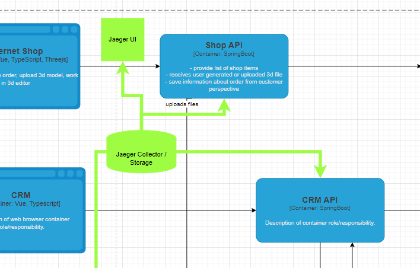

# Задание 3. Трейсинг

## 1. Архитектурное решение по трейсингу

# Система для трейсинга

1.  **Онлайн-магазин**

    > Заказ создаётся в системе `(статус INITIATED)` — здесь заказ может зависнуть, если пользователь не может добавить товар в корзину или столкнётся с ошибкой на этапе создания заказа.

    > Загрузка 3D-модели `(статус FILE_UPLOADED)` - на этом этапе могут возникать ошибки загрузки файла, зависания при обработке больших файлов, что влияет на дальнейшую работу

    > Создание заказа `(статус SUBMITTED)` — заказ может не быть отправлен в систему из-за ошибок на сервере или проблем с авторизацией пользователя.

2.  **MES (Manufacturing Execution System)**

    > Расчёт стоимости `(статус PRICE_CALCULATED)` — это один из самых критичных этапов. Если расчёт занимает слишком много времени (например, более 30 минут на сложных моделях), система может не успеть обработать заказ вовремя.

    > Подтверждение заказа для производства `(статус MANUFACTURING_APPROVED)` — это может быть точкой зависания, если сообщение из CRM не поступает вовремя или с ошибкой.

    > Начало производства `(статус MANUFACTURING_STARTED)` — заказ может не попасть в производственный процесс, если оператор не может взять заказ.

    > Завершение производства `(статус MANUFACTURING_COMPLETED)` — если заказ не отмечен как завершённый, это может быть связано с ошибками при записи в систему.

    > Упаковка и отправка `(статус PACKAGING, SHIPPED)` — это важные точки, которые должны быть отслежены, чтобы предотвратить зависания или ошибочную информацию о доставке.

3.  **CRM**

    > Подтверждение и завершение заказа `(статус MANUFACTURING_APPROVED, CLOSED)` — важно, чтобы заказ корректно проходил через CRM и получал правильный статус. Ошибки на этом этапе могут означать, что заказ не попал в нужное состояние.

    > `Взаимодействие с API` — когда заказ передаётся через API (например, для расчёта стоимости), важно убедиться, что запросы и ответы проходят без задержек и ошибок.

    > `Очередь сообщений` - важно отслеживать любые задержки или потери

# Мотивация

Внедрение трейсинга в систему компании «Александрит» позволит:

- **Мониторить производительность** на всех этапах обработки заказа.
- **Улучшить прозрачность процессов** в системе, повысив видимость всех этапов и взаимодействий между приложениями (онлайн-магазин, CRM, MES, API).
- **Выявлять и устранять проблемы** с производительностью и сбоями в реальном времени, минимизируя время простоя системы.
- **Оптимизировать процессы** на основе данных, получаемых из трейсинга, для повышения эффективности работы.

Трейсинг поможет отслеживать жизненный цикл заказа, а также взаимодействие между различными системами и слоями инфраструктуры.

## Метрики, на которые повлияет внедрение трейсинга

### Технические метрики:

1. **Время отклика системы**: Среднее время обработки заказа на каждом этапе.
2. **Частота ошибок и сбоев**: Количество ошибок в процессе обработки заказа.
3. **Процент успешных API-запросов**: Доля успешных запросов между системами (MES, CRM, онлайн-магазин).

### Бизнес-метрики:

1. **Удовлетворенность клиентов**: Улучшение опыта пользователей за счет более быстрых откликов и повышения надежности.
2. **Производительность системы**: Способность справляться с увеличением нагрузки (рост заказов).
3. **Скорость расчета стоимости**: Снижение времени на расчет стоимости заказа, улучшение сроков исполнения.

## Зачем это нужно:

- **Оперативное устранение проблем**: Реальное время отслеживания узких мест и ошибок.
- **Масштабируемость**: Подготовка системы к будущему росту и увеличению заказов.
- **Улучшение клиентского сервиса**: Снижение числа жалоб и повышение качества обслуживания.

# Предлагаемое решение

Трейсинг будет реализован через технологии `Jaeger` и `OpenTelemetry `. В каждый эндпоинт, где нам нужна подробная трассирова, мы должны установить пакеты OpenTelemetry и Jaeger. Jaeger подходит для понимания полного пути запроса в микросервисной архитектуре. Внутри контроллера нужна прописать `trace_id` и `span_id `, которые позволяют восстановить контекст всей операции. Jaeger используется для визуализации цепочки вызовов микросервисов и определения точного места возникновения задержек в запросах. Данные технологии будут внедрены в следующие компоненты на существующей схеме: **Shop API**, **CRM API** и **MES API**. В микросервисной архитектуре нужно реализовать в зависимости домена сервиса.

[Схема системы трейсинга](./tracing_jewerly_c4_model.drawio)

### 🏗 Компоненты и связи

### Автоматический мониторинг процесса прохождения заказа и алертинг (Дополнительное задание)

Автоматический мониторинг и алертинг будут реализованы на основе данных трейсинга, получаемых из приложений онлайн-магазина, CRM и MES.

#### 1. **Сбор данных трейсинга**

Каждое приложение (онлайн-магазин, CRM, MES) будет интегрировано с системой трейсинга (например, **OpenTelemetry** или **Jaeger**) для сбора данных о процессе обработки заказов. Каждое событие, связанное с изменением статуса заказа (например, `INITIATED`, `FILE_UPLOADED`, `PRICE_CALCULATED`), будет отправляться в централизованный сервис трейсинга.

#### 2. **Мониторинг в реальном времени**

- **Prometheus** будет собирать метрики о времени обработки заказов, задержках и ошибках с каждой системы (онлайн-магазин, CRM, MES).
- **Grafana** будет использовать эти метрики для создания дашбордов с реальным состоянием заказов, включая статус, время обработки и количество ошибок.

#### 3. **Алертинг**

- **Alertmanager** будет настроен для отправки уведомлений, если:
  - Время обработки заказа превышает допустимые пороги.
  - Статус заказа не обновляется в течение определённого времени (например, застрял в `PRICE_CALCULATED`).
  - Ошибки на любом из этапов (онлайн-магазин, CRM, MES) превышают допустимый уровень.

#### 4. **Реализация**

- Используемые технологии: **Prometheus**, **Grafana**, **Alertmanager**, **OpenTelemetry** / **Jaeger**.
- Пороги и правила алертинга будут настраиваться в зависимости от важности и критичности каждого этапа обработки заказа.

# Компромиссы

1. **Интеграция с MES (C#)**

   - Внедрение трейсинга в MES может потребовать дорогостоящих доработок, так как система проприетарная, а интеграция может потребовать значительных изменений в коде.
   - `Когда не принесет пользы:` если доработка требует переработки архитектуры системы, что может занять слишком много времени и ресурсов.

2. **Высокая нагрузка на систему**

   - Трейсинг может добавить дополнительные задержки, особенно при высокой нагрузке, что критично для процессов, таких как расчёт стоимости заказа и обработка больших объемов данных.
   - `Когда не принесет пользы:` если внедрение трейсинга снизит производительность системы, замедляя обработку заказов.

3. **Интеграция с различными системами (MES, CRM, онлайн-магазин)**

   - Множественные системы с различными технологиями и форматами данных могут затруднить внедрение единой системы трейсинга.
   - `Когда не принесет пользы:` если интеграция между различными системами требует сложных решений, а выгоды от трейсинга не оправдывают затраты.

4. **Ограничения по времени на реализацию**

   - В условиях активного роста и критичных жалоб со стороны клиентов внедрение трейсинга может занять слишком много времени, что замедлит решение других более срочных проблем.
   - `Когда не принесет пользы:` если реализация затянет сроки, а решение текущих проблем требует быстрых действий.

5. **Дорогостоящая доработка и поддержка**

   - Реализация и поддержка трейсинга в сложной инфраструктуре потребуют значительных усилий на настройку, тестирование и эксплуатацию.
   - `Когда не принесет пользы:` если стоимость внедрения и поддержания трейсинга слишком высока, а система уже сталкивается с проблемами производительности.

6. **Проблемы с конфиденциальностью данных**
   - Трейсинг может захватывать чувствительные данные, что создаёт риски для конфиденциальности и безопасности.
   - `Когда не принесет пользы:` если внедрение трейсинга нарушает принципы безопасности и требует сложных процедур контроля доступа.

# Безопасность

- Трейсинг не должен работать с `чуствительными данными` такими, как ФИО, номера телефонов и тд.
- Jager UI, как и вся инфраструктура должна быть под корпоративным `VPN`
- Данные должны передаваться по криптографическому протоколу `TLS/SSL`
- Управление доступом на основе ролей `(RBAC)`
- Изоляция среды. Jaeger будет развернут в контейнере.
- Аутентификация и авторизация
