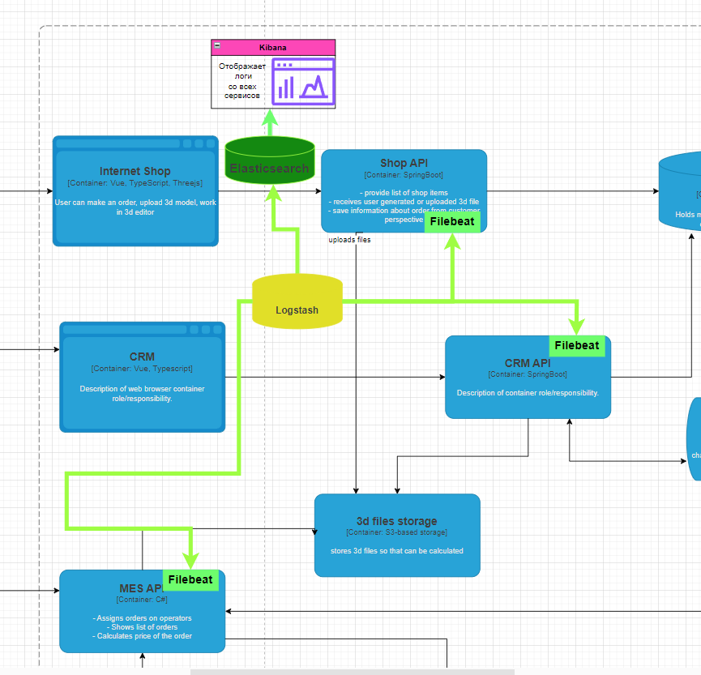

# Задание 4. Логирование

## 1. Архитектурное решение по логированию

Для обеспечения мониторинга, отладки и анализа работы системы необходимо собирать логи из всех ключевых компонентов:

- **Онлайн-магазин (Vue, Java Spring Boot)**
- **CRM (Vue, Java Spring Boot)**
- **MES (React, C#)**
- **RabbitMQ** (передача сообщений между CRM и MES)

## 📝 Какие логи собираем?

### 1️⃣ **Изменение статуса заказа**

- **Уровень:** `INFO`
- **Детали:**
  - Время события
  - Идентификатор покупателя
  - Номер заказа
  - Предыдущий и новый статус

### 2️⃣ **Запросы к API**

- **Уровень:** `INFO`
- **Детали:**
  - Время запроса
  - IP клиента
  - Метод и URL
  - Тело запроса (если допустимо)

### 3️⃣ **Ошибки при расчёте стоимости в MES**

- **Уровень:** `ERROR`
- **Детали:**
  - Время ошибки
  - Номер заказа
  - Причина ошибки

### 4️⃣ **Длительность расчёта стоимости в MES**

- **Уровень:** `INFO`
- **Детали:**
  - Время начала и завершения расчёта
  - Номер заказа
  - Количество полигонов в модели

### 5️⃣ **Очередь сообщений Kafka**

- **Уровень:** `INFO`
- **Детали:**
  - Время отправки сообщения
  - Отправитель и получатель
  - Тема сообщения

### 6️⃣ **Производственные операции в MES**

- **Уровень:** `INFO`
- **Детали:**
  - Время начала и завершения
  - ID оператора
  - Статус операции

## 🔥 Когда используем другие уровни логирования?

- `DEBUG` – для локальной отладки в dev-окружении
- `ERROR` – для критических ошибок, влияющих на работу системы
- `WARN` – для потенциальных проблем (например, задержка обработки заказа)

## 🚀 Где собираем логи?

- **Онлайн-магазин** → Заказы и взаимодействие клиентов
- **CRM** → Управление заказами, статусы
- **MES** → Производственные операции, расчёт стоимости
- **Kafka** → Передача сообщений

## 📊 Мониторинг и хранение логов

- Логи храним в **Yandex Cloud Logging**
- Используем **Grafana + Loki** для визуализации

---

# Мотивация

В систему нужно добавить логирование так, как это сокращает время устранения ошибок, особенно критических, что является важным аргументом для бизнеса. Логирование помогает быть продукту конкурентным на рынке и увеличиваит аудиторию клиентов.

### 5 метрик, на которые влияет логирование

1.  `Среднее время обработки заказа`. Логирование производственных операций в MES позволит не терять дорогостоящих клиентов и иметь улучшенную клиентоориентированность. Если клиент построил слишком сложную 3D модель и сработал Alert по определению цены товары больше 30 минут, можно посмотреть логи и выяснить более детально что случилось.

2.  `Время реакции на инциденты` – ускорение поиска и устранения ошибок.

3.  `Ошибки интеграции между системами` – снижение числа несогласованных данных.

4.  `Процент успешных заказов` – уменьшение количества неуспешных транзакций.

5.  `Нагрузка на серверы` – возможность мониторинга и оптимизации.

### Приоритетсность логирования и трейсинга

🔥 1. CRM и Онлайн-магазин (Frontend + Backend)

> Эти системы напрямую взаимодействуют с клиентами. Нужно отселиживоть потерю заказов

🔥 2. MES (Система управления производством)

> Ошибки MES влияют на расчёт стоимости заказа и сроки производства

🔥 3. Очереди сообщений между CRM и MES (Kafka)

> Напрямую влияет на расчёт стоимости и выполнение заказов.

### Предлагаемое решение

В теории было написано только про ELK + Filebeat агент. Будем использовать этот стек.

**Компоненты системы:**

1. **Filebeat** – легковесный агент для сбора логов с серверов Java-приложений.
2. **Logstash** – инструмент для предобработки логов (парсинг, фильтрация, нормализация).
3. **Elasticsearch** – хранилище логов, обеспечивающее быстрый поиск и анализ.
4. **Kibana** – инструмент визуализации и построения дашбордов.
5. **Alerting (ElastAlert)** – система оповещений по аномалиям и критическим событиям.

### Диаграмма последовательности действий

[Схема системы логирования](./logging_jewerly_c4_model.drawio))



### 🏗 Компоненты и связи

```plaintext
(Shop API) → (Filebeat) →
(MES API)  → (Filebeat) →  (Logstash) → (Elasticsearch Index: logs-app) → (Kibana Dashboard: App Logs)
(CRM API)  → (Filebeat) →

(System Logs) → (Filebeat) → (Logstash) → (Elasticsearch Index: logs-system) → (Kibana Dashboard: System Logs)

(Security Logs) → (Filebeat) → (Logstash) → (Elasticsearch Index: logs-security) → (Kibana Dashboard: Security Logs)
                                          ↓
                                     (ElastAlert → Alerting via Email/Slack)
```

---

### 🔐 Политика безопасности

- Логи с чувствительными данными (пароли, токены, персональные данные) будут маскироваться на уровне Logstash перед сохранением в Elasticsearch.

- Доступ к Kibana и Elasticsearch будет ограничен по ролям:

  > `admin` – полный доступ (разработчики, DevOps).

  > `support` – только просмотр логов без возможности удаления.

  > `security` – доступ только к аномалиям и критическим событиям.

- В Kibana включена защита от SQL-инъекций и XSS

### 🗄 Политика хранения логов

📂 `Разделение индексов`

Каждая микросервисная система получает свой отдельный индекс в **Elasticsearch**, что упрощает поиск и анализ данных.

**Примеры индексов:**

- `logs-shop-service-*` – аутентификация и авторизация
- `logs-mes-service-*` – платежная система
- `logs-crm-service-*` – управление пользователями

### ⏳ Срок хранения

| Тип логов                 | Срок хранения | Дополнительные условия            |
| ------------------------- | ------------- | --------------------------------- |
| 📋 **Обычные логи**       | 30 дней       | Стандартные логи работы системы   |
| 🔥 **Критические ошибки** | 90 дней       | Ошибки уровня `ERROR` и `FATAL`   |
| 🏛 **Архивные данные**     | Долгосрочно   | Переносятся в **S3** для хранения |

### 📏 Ограничение объема

- **Максимальный размер индекса:** `50 ГБ`
- После достижения лимита автоматически создается новый индекс
- **Старые индексы удаляются автоматически** согласно политике хранения

### 🔄 Оптимизация хранения

- **Ротация индексов** на основе размера и времени
- **Удаление неактуальных данных** для экономии ресурсов
- **Хранение архивов в S3** для долгосрочного анализа

---

# Шаги для превращения системы сбора логов в систему анализа логов

## 🚨 Настройка алертинга

Эффективная система логирования требует **мгновенного реагирования** на критические события.  
Алерты должны покрывать ключевые метрики стабильности системы:

- **Критические ошибки (`ERROR`, `FATAL`)** → мгновенные уведомления (Slack, Telegram, Email).
- **Отсутствие логов от сервиса** → возможное падение микросервиса, триггер перезапуска.
- **Резкий рост ошибок или нагрузки** → возможные сбои, утечки памяти, DDoS-атаки.

📌 **Решение:**

- **ElastAlert / Kibana Watcher** – создание триггеров на основе логов.
- **Prometheus + Grafana Alerts** – реакция на метрики нагрузки.
- **Интеграция с инцидент-менеджментом (Jira, ServiceNow).**

---

## 📊 Поиск аномалий

Идентификация отклонений позволяет **предотвращать атаки и сбои** до их критического влияния.

### ⚠️ Критичные аномалии:

- **Аномальный рост запросов** (10x увеличение за секунду) → вероятная DDoS-атака.
- **Резкое падение числа логов** → возможный отказ сервиса.
- **Всплеск ошибок БД** → признаки перегрузки или сбоя репликации.

📌 **Решение:**

- **Machine Learning в Elastic Stack** – автоматический анализ логов.
- **ElastAlert** – триггеры на резкие скачки активности.
- **Связка с APM (Elastic APM, Jaeger, OpenTelemetry)** – отслеживание трассировки запросов.

---

## 🛡 Автоматизация реакции

🚀 **Цель:** Исключить ручное вмешательство и ускорить устранение инцидентов.

- Автоматическое **блокирование подозрительных IP** при DDoS-атаках.
- Генерация **тикетов с инструкциями по устранению** (Jira, ServiceNow).
- Включение **автоматического скейлинга**, если сервис перегружен.

📌 **Решение:**

- **WAF (Web Application Firewall)** + автообновление правил безопасности.
- **Auto-healing сервисов** через Kubernetes + Prometheus.

---

# Критерии для выбора технологии для работы с логами

При выборе технологии для работы с логами важно учитывать не только лицензию и стоимость, но и такие аспекты, как масштабируемость, гибкость настройки и сложность установки. Ниже приведена улучшенная таблица, в которой подробно сравниваются популярные решения для логирования: **ELK (Elasticsearch, Logstash, Kibana)**, **OpenSearch**, **Splunk**, и **Fluentd + ClickHouse**.

| Критерий                             | **ELK (Elasticsearch, Logstash, Kibana)**                     | **OpenSearch**                                                    | **Splunk**                                                       | **Fluentd + ClickHouse**                                                   |
| ------------------------------------ | ------------------------------------------------------------- | ----------------------------------------------------------------- | ---------------------------------------------------------------- | -------------------------------------------------------------------------- |
| **Лицензия**                         | Elastic License                                               | Apache License, Version 2.0                                       | Проприетарная                                                    | Apache License, Version 2.0                                                |
| **Стоимость**                        | Бесплатно (с открытым исходным кодом) + платная поддержка     | Бесплатно (с открытым исходным кодом) + платная поддержка         | Платно, лицензия по объему данных                                | Бесплатно с возможностью коммерческого использования                       |
| **Масштабируемость**                 | Высокая, поддерживает большие объемы данных                   | Высокая, но требуется настройка для крупных систем                | Очень высокая, идеально для крупных данных                       | Очень высокая, поддержка больших объемов                                   |
| **Гибкость настройки**               | Очень гибкая настройка, поддержка множества источников данных | Гибкая настройка, поддержка Elasticsearch API                     | Меньше гибкости, но высококачественная настройка через интерфейс | Очень гибкая настройка, поддержка множества интеграций                     |
| **Сложность установки и управления** | Средняя, сложная настройка компонентов (Logstash, Beats)      | Средняя, аналогична ELK, но с улучшенной документацией            | Простота установки, но требует лицензии                          | Средняя, требует настройки Fluentd и ClickHouse                            |
| **Поддержка и сообщество**           | Большое сообщество, активная разработка, платная поддержка    | Активное сообщество, разработчики из AWS, OpenSource документация | Платная поддержка, но меньше открытого сообщества                | Активное сообщество, хорошая документация по настройке                     |
| **Простота интеграции**              | Легко интегрируется с популярными сервисами и инструментами   | Хорошая интеграция с AWS и сторонними решениями                   | Легкая интеграция с продуктами Splunk                            | Интеграция с множеством систем через Fluentd                               |
| **Производительность**               | Высокая, может снижаться при неправильной настройке           | Отличная производительность для поиска и аналитики                | Очень высокая, оптимизирована для крупных данных                 | Очень высокая для аналитики в реальном времени                             |
| **Мониторинг и аналитика**           | Kibana предоставляет мощные инструменты для визуализации      | Похож на Kibana, но требует настройки                             | Встроенные высококачественные отчеты и панели                    | Может использовать внешние инструменты для визуализации, например, Grafana |

## Обоснование выбора

### 1. **Лицензия**

- **ELK** и **OpenSearch** — оба предоставляют открытые лицензии с возможностью платной поддержки. OpenSearch имеет более свободную лицензию (**Apache 2.0**), что дает больше гибкости в использовании и интеграции.
- **Splunk** — коммерческое решение, стоимость может быстро возрасти с увеличением объема данных.
- **Fluentd + ClickHouse** — открытые лицензии, которые обеспечивают бесплатное использование и возможность интеграции с другими решениями.

### 2. **Стоимость**

- **ELK** и **OpenSearch** — решения с открытым исходным кодом, но платная поддержка для крупных инфраструктур.
- **Splunk** — дорогое решение, особенно для крупных организаций с большими объемами логов.
- **Fluentd + ClickHouse** — полностью бесплатные решения с открытым исходным кодом, что делает их идеальными для организаций с ограниченными бюджетами.

### 3. **Масштабируемость**

- **Splunk** и **Fluentd + ClickHouse** предоставляют очень высокую масштабируемость для работы с большими объемами данных.
- **ELK** и **OpenSearch** тоже масштабируются, но могут требовать дополнительной настройки и ресурсов на больших данных.

### 4. **Гибкость настройки**

- **ELK** и **OpenSearch** предлагают отличную гибкость настройки, поддерживают множество источников данных и интеграций.
- **Fluentd + ClickHouse** также обеспечивают гибкость, особенно в части настройки источников данных.
- **Splunk** имеет ограниченную гибкость, но предлагает высококачественную настройку через веб-интерфейс.

### 5. **Сложность установки и управления**

- **Splunk** предлагает простоту установки, но его проприетарная модель требует платной лицензии.
- **ELK** и **OpenSearch** требуют дополнительной настройки и могут быть сложными в эксплуатации, особенно в больших системах.
- **Fluentd + ClickHouse** требуют больше усилий для настройки, но дают большую гибкость и контроль.
