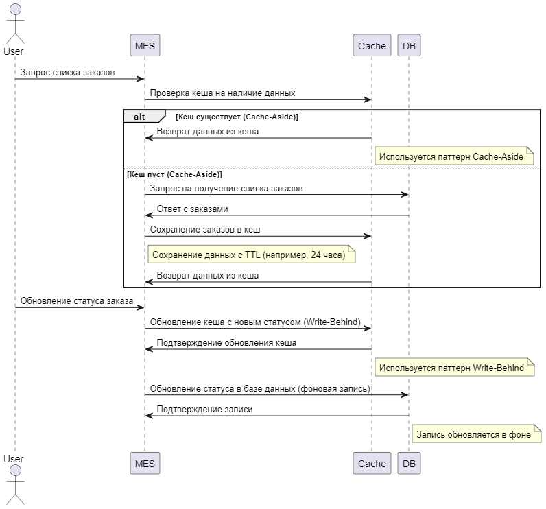

# Задание 5. Кеширование

## 1. Архитектурное решение по кешированию

## 🧠 Мотивация

Внедрение кеширования необходимо для оптимизации работы системы, снижения нагрузки на базы данных и ускорения обработки заказов. Основные проблемы, которые кеширование должно решить:

- **Долгое время загрузки дашбордов в MES.**
- **Высокая нагрузка на API MES из-за расчёта стоимости заказов.**
- **Задержки в обработке заказов, вызванные частыми запросами к базе данных CRM и MES.**

### 🔥 Элементы системы для кеширования

1️⃣ **Кеширование дашбордов в MES**

- **Проблема:** Операторы жалуются на долгую загрузку первой страницы MES с заказами.
- **Решение:** Используем `Cache-Aside`. Дашборд загружается из кеша, а при изменении данных обновляется в фоне.
- **Технология:** Redis с TTL на 1-5 минут.

2️⃣ **Кеширование расчёта стоимости заказа в MES**

- **Проблема:** MES рассчитывает стоимость до 30 минут, а повторные запросы пользователей перегружают систему.
- **Решение:** Используем `Read-Through`. Если стоимость уже рассчитана, она загружается из кеша.
- **Технология:** Redis с хранением результатов расчётов на 24 часа.

3️⃣ **Кеширование статусов заказов в CRM**

- **Проблема:** Высокая нагрузка на базу CRM из-за частых обновлений статусов.
- **Решение:** Используем `Write-Behind`. При изменении статуса сначала обновляем кеш, а затем базу в фоне.
- **Технология:** Redis с хранением статусов 10-15 минут.

4️⃣ **Кеширование API MES для внешних продавцов**

- **Проблема:** Рост числа заказов через API вызывает перегрузку системы.
- **Решение:** Используем `Write-Through`. Запросы сначала записываются в кеш, затем в базу.
- **Технология:** Redis + механизм обновления данных при записи.

5️⃣ **Кеширование списка доступных товаров в онлайн-магазине**

- **Проблема:** Частые запросы к базе для загрузки каталога товаров.
- **Решение:** Используем `Refresh-Ahead`. Данные обновляются в фоне, а пользователи всегда получают свежий кеш.
- **Технология:** Redis с автообновлением каждые 10-30 минут.

---

## 💡 Предлагаемое решение

Мы предлагаем внедрить **серверное кеширование**, так как оно позволяет централизованно управлять кешем, значительно снижая нагрузку на клиентские устройства и повышая скорость обработки запросов. В данном случае серверное кеширование будет использоваться для кеширования данных, которые часто запрашиваются и часто обновляются.

### Паттерны кеширования

- **Cache-Aside** — применяется для кеширования дашбордов в MES, где данные обновляются в фоне, а кеш загружается по запросу. Этот паттерн подходит, так как данные изменяются не так часто, и кеширование существенно ускоряет время загрузки.
- **Read-Through** — используется для кеширования расчёта стоимости заказа в MES, когда результат расчёта может быть долго вычисляемым и часто запрашиваемым. Если стоимость уже рассчитана, она загружается из кеша.

- **Write-Behind** — применяется для кеширования статусов заказов в CRM. В данном случае мы обновляем кеш сразу, а базу данных — в фоновом режиме, что позволяет уменьшить нагрузку на систему в пиковые моменты.

- **Write-Through** — используется для кеширования API MES, при этом данные записываются сначала в кеш, а затем в базу. Это гарантирует консистентность данных.

- **Refresh-Ahead** — применяется для кеширования списка доступных товаров в онлайн-магазине, где данные обновляются в фоне, и пользователи всегда получают актуальную информацию.

### Почему выбранные паттерны

- **Cache-Aside** подходит для случаев, когда данные часто запрашиваются, но не часто меняются. Этот паттерн хорошо работает для дашбордов.
- **Read-Through** оптимизирует запросы к дорогим вычислениям, таких как расчёт стоимости заказа, так как кеш обеспечивает быстрый доступ к уже рассчитанным данным.
- **Write-Behind** идеально подходит для обновления данных с небольшой задержкой, что важно при обновлении статусов заказов в CRM.
- **Write-Through** обеспечивает консистентность данных между кешом и базой, что особенно важно для API взаимодействий.
- **Refresh-Ahead** позволяет поддерживать актуальные данные в кешах без воздействия на производительность, что важно для отображения актуального каталога товаров.

Этот подход позволит нам обеспечить баланс между производительностью системы и консистентностью данных, обеспечив стабильную работу всех критичных процессов.

### Диаграмма последовательности действий

[Диаграмма последовательности действий](./cache_jewerly_c4_model.puml)

### Стратегия инвалидации кеша

Для обеспечения актуальности данных и предотвращения устаревания кешированных значений предлагается использовать стратегию инвалидации кеша на основе **времени жизни (TTL)**. Этот подход подходит для большинства кешируемых данных, так как гарантирует автоматическое обновление данных по истечении заданного времени.

#### Почему выбран TTL:

- **Простота реализации**: Время жизни кеша можно настроить, что упрощает управление данными.
- **Производительность**: Данные будут автоматически удаляться из кеша через фиксированное время, что позволяет уменьшить нагрузку на систему без необходимости отслеживания изменений каждого элемента.
- **Актуальность данных**: Для большинства данных, таких как расчёты стоимости заказов или статусы, TTL обеспечивает приемлемую частоту обновлений.

#### Почему не подходят другие стратегии инвалидации:

1. **Инвалидация по ключу**:

   - Требует постоянного отслеживания изменений в данных.
   - Может привести к излишней нагрузке на систему и сложностям в реализации, особенно при большом объёме данных.
   - **Не подходит** для данных, которые обновляются нечасто и не критичны для мгновенного обновления.

2. **Программная инвалидация**:
   - Требует вручную обновлять кеш в зависимости от бизнес-логики, что делает систему более сложной.
   - Может быть подвержена ошибкам и требует дополнительной логики для отслеживания и обновления данных.
   - **Не подходит** для данных, которые не изменяются слишком часто, и когда актуальность данных не требует немедленного вмешательства.

#### Сравнительный анализ стратегий инвалидации кеша

| Стратегия                   | Описание                                          | Преимущества                                                             | Недостатки                                                                    | Когда использовать                                                                                       |
| --------------------------- | ------------------------------------------------- | ------------------------------------------------------------------------ | ----------------------------------------------------------------------------- | -------------------------------------------------------------------------------------------------------- |
| **Временная (TTL)**         | Данные удаляются через заданный интервал времени. | Простота реализации, гарантированное обновление данных по истечении TTL. | Может не подходить для данных, требующих немедленного обновления.             | Когда данные обновляются с определенной периодичностью и нет необходимости в мгновенном обновлении.      |
| **Инвалидация по ключу**    | Кеш удаляется при изменении данных по ключу.      | Точное обновление данных.                                                | Высокая сложность реализации, нагрузка на систему при отслеживании изменений. | Когда требуется мгновенное обновление кеша после изменения данных, например, в критичных приложениях.    |
| **Программная инвалидация** | Кеш очищается вручную через логику приложения.    | Полный контроль над кешированием, гибкость в управлении.                 | Сложность в реализации и риск ошибок.                                         | Когда требуется сложная логика для управления кешированием, например, для специфических бизнес-операций. |

#### Почему выбрана стратегия TTL:

- **TTL** является оптимальной стратегией для большинства данных в нашей системе, так как обеспечивает баланс между простотой реализации и актуальностью данных. Для данных, которые обновляются с приемлемой частотой, TTL гарантирует своевременное обновление без излишней нагрузки на систему.
- Для **заказов в MES** и **статусов заказов** это решение идеально подходит, так как информация обновляется не слишком часто, и её актуальность можно поддерживать через заданное время жизни кеша.
